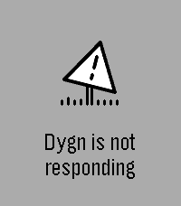

# Dagsljus

24-hour one-hand watchface for Pebble Time 2 (emery, 200x228). One hand,
one rotation per day. Port of [SingleHanded #2](https://github.com/fsargent/pebble-slow-24h)
by fsargent (branch `one-hand-24h-design-2`).

Noon at the top, midnight at the bottom. The outer ring is white while the
sun is up and black at night, using today's sunrise/sunset for your location
(Open-Meteo via the phone). Hours with >50% rain chance get a blue arc.



## Settings

Phone app, gear icon on the watchface:

- Location: a city name for sunrise/sunset (looked up via Open-Meteo
  geocoding). Leave empty to use the phone's location.
- 12-hour numerals (on by default)
- Show rain overlay (on by default)

## Build and install

```
pebble build
pebble install --emulator emery
pebble install --phone <phone ip>     # developer connection on in the Pebble app
```

The bundle is `build/dagsljus.pbw`; it can also be sideloaded from the phone.

## Emulator notes

The emulator has no location, so sunrise/sunset fall back to the defaults in
`src/c/main.c`. The JS side sends its stored settings on start, so to test a
setting in the emulator change both the C default and the fallback in
`currentSettings()` in `src/pkjs/index.js`.

## Store listing

The appstore description is in `DESCRIPTION.txt`.
